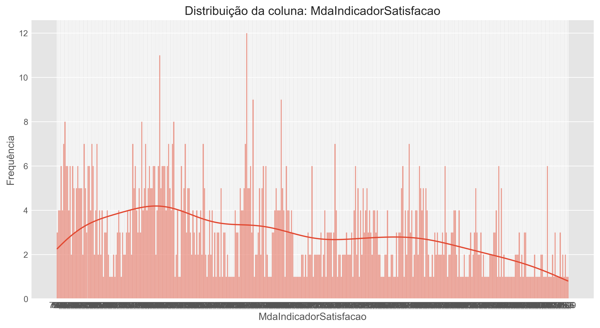
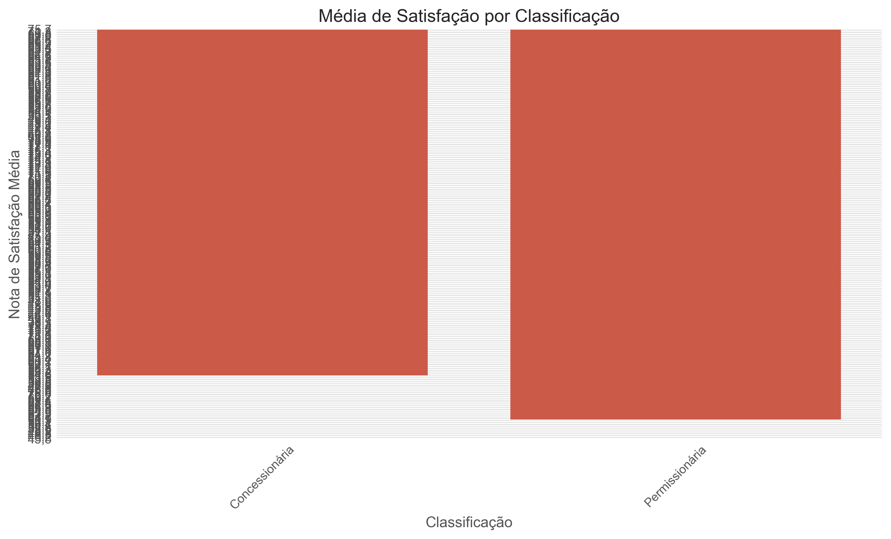
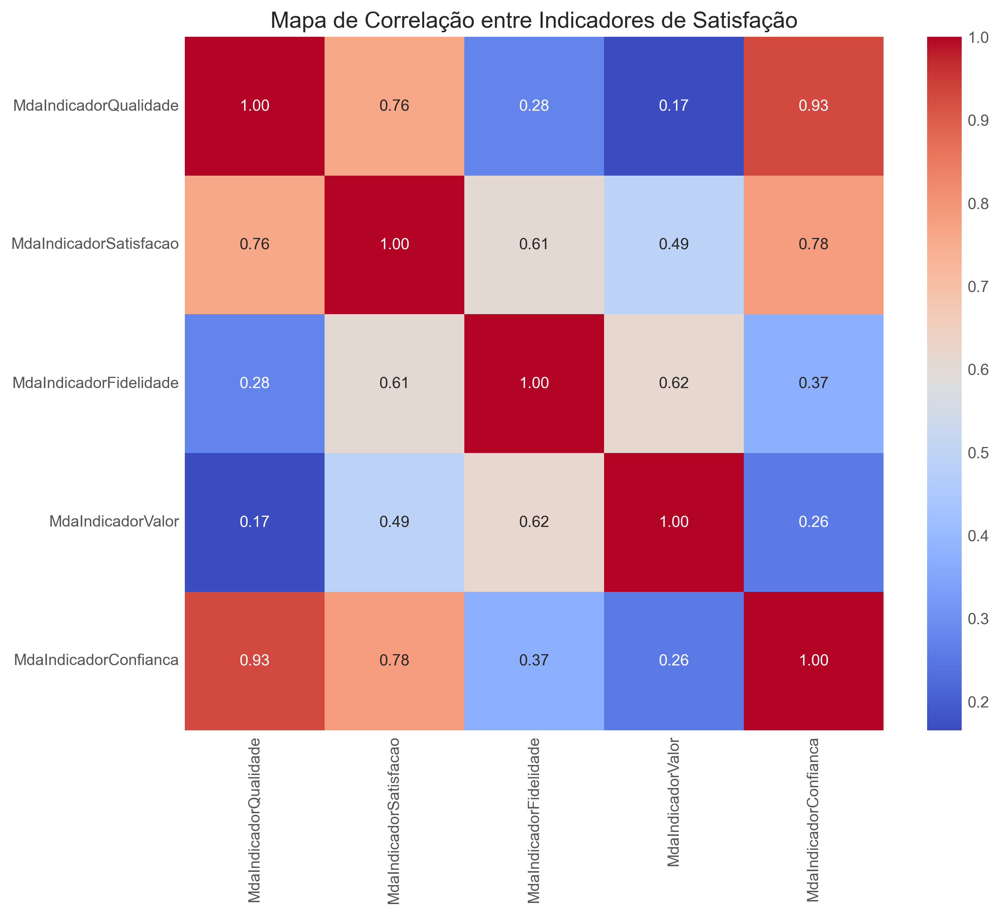
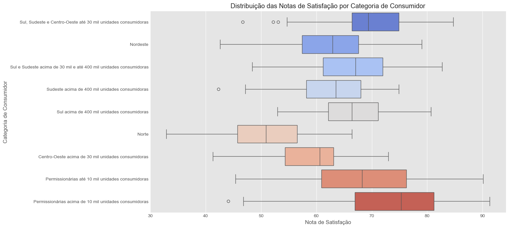
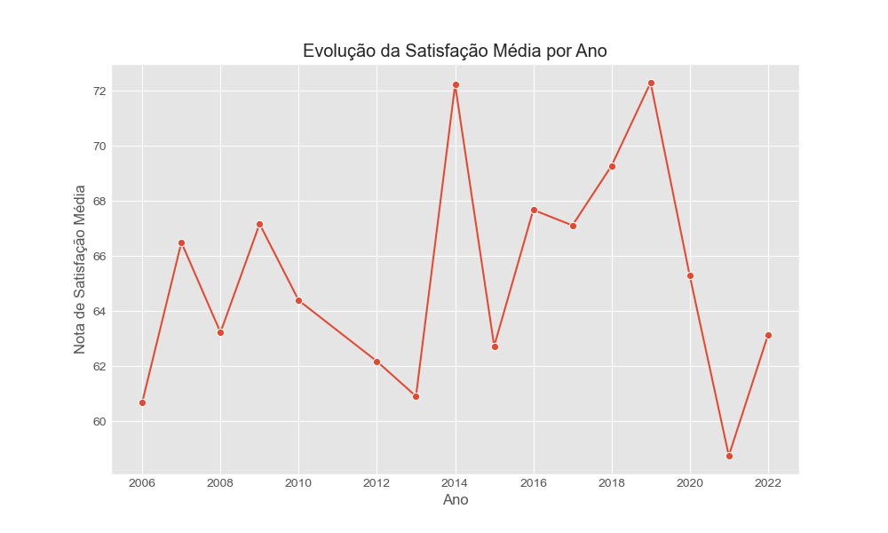

(imagens/aneel.png)


# Análise de Satisfação do Consumidor ANEEL

Este projeto realiza uma análise detalhada dos dados de satisfação do consumidor fornecidos pela ANEEL. Foram analisados diversos indicadores de qualidade percebida pelos consumidores de energia elétrica, como qualidade, confiança e satisfação geral.

## 📂 Sobre os Dados

O dataset contém as seguintes colunas relevantes:

- **Ano**: Ano de referência da pesquisa
- **DscClassificacao**: Classificação da distribuidora (por tamanho ou grupo)
- **Descricao Categoria**: Categoria de distribuição de energia
- **Agente**: Nome da distribuidora de energia
- **CNPJ**: Identificador da distribuidora
- **Ordem IASC**: Índice ANEEL de Satisfação do Consumidor
- **Indicadores**: MdaIndicadorQualidade, MdaIndicadorSatisfacao, MdaIndicadorFidelidade, MdaIndicadorValor, MdaIndicadorConfianca

Os dados foram importados e tratados com codificação adequada, convertendo valores decimais no padrão brasileiro para ponto flutuante.

---

## 📈 Análises Realizadas

### 1️⃣ Distribuição das Notas de Satisfação

Este gráfico mostra a distribuição geral das notas de satisfação.



---

### 2️⃣ Satisfação por Classificação

Este gráfico mostra a média de satisfação segmentada por classificação de distribuidoras.



---

### 3️⃣ Matriz de Correlação

Análise da correlação entre os principais indicadores de satisfação e qualidade.



---

### 4️⃣ Boxplot por Categoria

Boxplot para comparar a distribuição da satisfação por categoria de distribuidoras.



---

### 5️⃣ Média de Satisfação por ano

Visualização da média de satisfação por ano.



---

## 🛠️ Tecnologias Utilizadas

- Python 3.9
- Pandas
- Matplotlib
- Seaborn
- Jupyter Notebook

---

## 🔍 Conclusões

- A maior parte das distribuidoras apresenta notas de satisfação concentradas entre 70 e 80 pontos.
- Alguns agentes apresentaram resultados acima da média, indicando boas práticas no atendimento ao consumidor.
- Há correlação significativa entre satisfação geral e confiança na distribuidora, indicando que estratégias para aumentar a confiança do consumidor podem impactar positivamente a satisfação geral.

---

## 📌 Como Reproduzir

1. Clone este repositório.
2. Instale as dependências necessárias:
    ```bash
    pip install pandas matplotlib seaborn jupyter
    ```
3. Execute o notebook de análise.
4. Os gráficos gerados serão salvos na pasta `imagens/` e referenciados neste README.

---

## 🤝 Contribuição

Contribuições são bem-vindas! Sinta-se à vontade para abrir issues ou pull requests.

---
